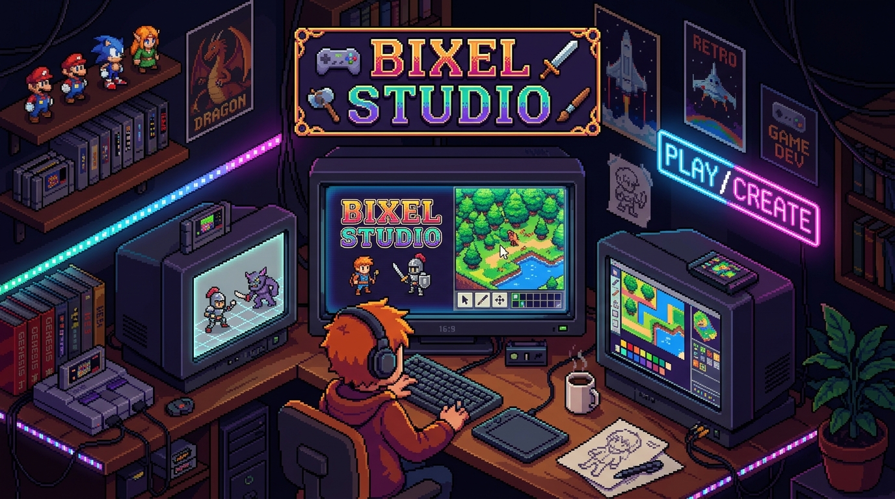

# Bixel Studio



**Bixel Studio** is a native macOS 2D game-asset studio designed for pixel artists, game developers, and animators. Built from the ground up for Apple Silicon with a sleek Procreate-style dark interface, Bixel Studio pairs high-performance native Metal rendering with a powerful Rust engine and an integrated AI assistant.

---

## ✨ Features

- **🎨 Pixel Art & Sprite Editor**
  - Full cel and layer management with blend modes, opacity, and visibility controls.
  - Classic palette presets (DB32, PICO-8, Game Boy) plus custom color disc and hex pickers.
  - Fluid, responsive drawing tools (brush, eraser, line, shape, flood fill).

- **⏱️ Animation Timeline**
  - Multi-frame timeline with tags, looping modes, and variable frame durations.
  - Real-time playback and customizable onion skinning for smooth frame-by-frame animation.

- **🗺️ Tilemap Designer**
  - Grid-based tilemap editing with layer support, autotiling, and pattern stamping.
  - Native compatibility with Tiled map formats for easy game engine export.

- **🤖 Integrated AI Assistant**
  - Natural-language game asset generation and spritesheet creation.
  - Image-to-image workflows: predict next animation frames, remove backgrounds, and quantize palettes.
  - Powered by flexible AI providers (OpenRouter & ChatGPT Codex).

- **⚡ Native Metal Performance**
  - Hardware-accelerated canvas rendering with infinite canvas navigation, butter-smooth zoom, and zero latency.

---

## 🚀 How to Start

### Prerequisites

- macOS 13.0 or later
- [Xcode](https://developer.apple.com/xcode/) (15.0+)
- [Rust](https://rustup.rs)
- [XcodeGen](https://github.com/yonaskolb/XcodeGen):
  ```bash
  brew install xcodegen
  ```

### Quick Start

Run the start script to set up the project and open it in Xcode:

```bash
./scripts/start.sh
```

Then press **Cmd + R** in Xcode to run the app.

> **Tip:** To build and launch the app directly from your terminal, run:
> ```bash
> ./scripts/start.sh --run
> ```

---

## 📖 Documentation & Handbook

Explore the complete [Bixel Studio Handbook](site/handbook/index.html) for detailed guides on the interface, drawing tools, keyboard shortcuts, animation timeline, tilemap designer, and AI assistant skills.

